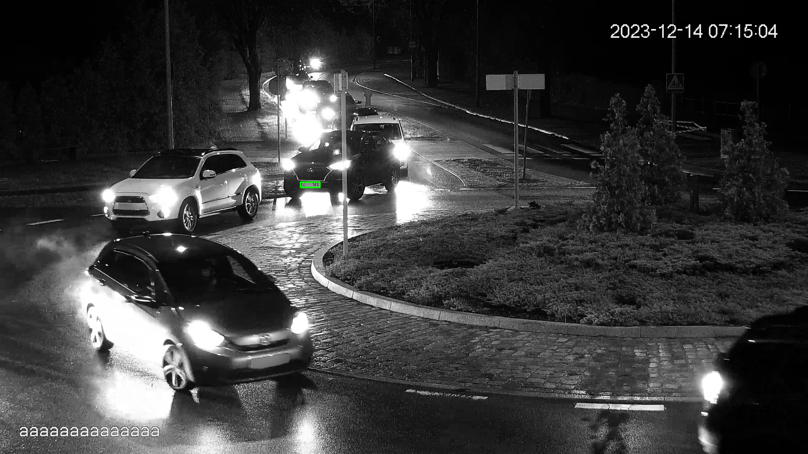
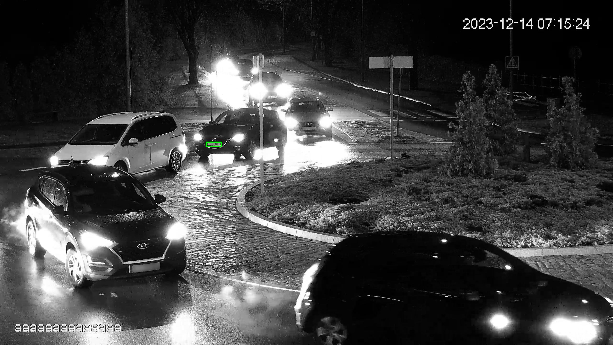
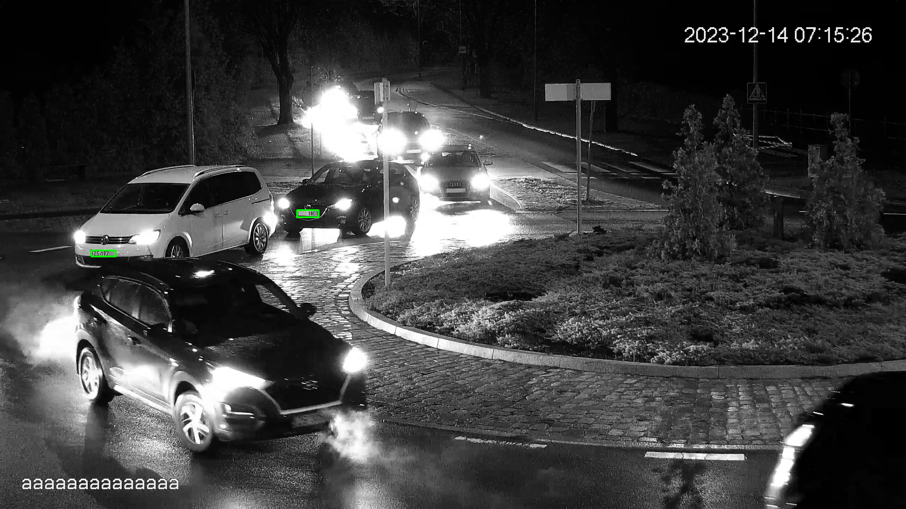
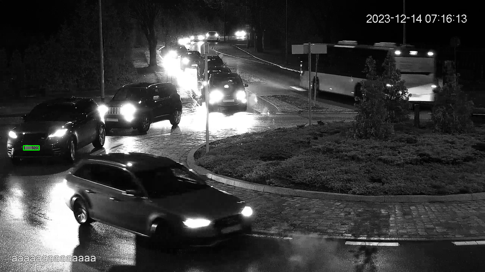
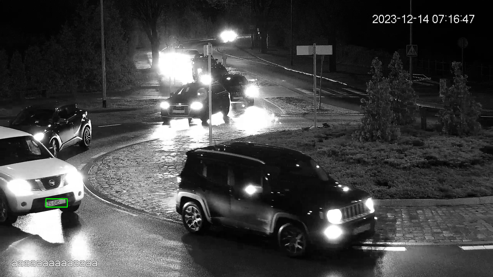

# What is this repository about
Welcome to my portfolio repository, which contains all of my share worthy projects that I have worked on and am working on!

Currently, the selection of projects is quite limited, but will be steadily growing.  

Some projects will only have their most interesting parts shared, while others will be viewable in their entirety.

The code included in this repository was written with the intention to make it as efficient, effective, and simple as possible while meeting all the stated requirements.

# My projects
## License plate recognition, version 1
_**"Genres"**_ - **Python**, **OpenCV**, **Computer** **vision**
### General description

The aim of the project is creating an application that will save cars' license plate numbers found in video streams of CCTV cameras.
The purpose of this is to quickly locate where and when a specific car appeared or determine if it did not.

Project is very close to completion and the most important features are already done. 
For now, I cannot share entirety of the code, as it _might_ become a product that will be sold.
I included most of the code responsible for license plate detection, tracking and number extraction. 
I chose to leave out the more boring parts, like those dealing with resource management.

### Requirements
1. Application should analyze video file/stream frames and read any found license plate numbers.
2. For every found license plate, following data should be saved: video frame, license plate number, date, time.
3. Application should be able to handle multiple license plates present in a single frame.
4. Application should be able to analyze input from multiple sources at the same time.
5. Application should analyze input in real time.
6. Application should also be able to work on image files.

### Project structure
The project's main structure consists of a primary class and two subprocess classes.
Usage of multiprocessing is necessary to meet #4 and #5 requirements. 

Class LPRecognition is the core of the application, which handles input reading and exchanges data with subprocesses.
Fragment of that class is included in project files, but contains only the main loop and a method distributing work to tracker subprocesses.

LPDetectionProcess and LPTrackersProcess are subprocess classes, which do the two main jobs of license plate recognition.

LPDetectionProcess finds license plates in frames sent by LPRecognition class. Entirety of that class is included in project files.

LPTrackersProcess initializes and updates trackers of license plates found by LPDetectionProcess. 
Usage of trackers is necessary to increase the probability of correctly reading license plate numbers. 
Details of that are described in the next section.
This class is not included in project files, but it is important to mention that it uses the Nano tracker.

https://docs.opencv.org/4.x/d8/d69/classcv_1_1TrackerNano.html

LPTracker class represents a single tracker, and it is used by LPTrackersProcess, which can handle multiple of them.
In project files only the most interesting part of it is included.

Project files also include the OCRModel class, which is used as a wrapper for different OCR modules.

The project uses many other important classes, e.g. SubprocessConnection, but those are not noteworthy and are excluded from shared project files.

Besides classes there is also a module of static utility functions. Most of them are included in LPRUtil directory. They are divided "thematically" into modules.

### How it works

The main task of the application is to extract license plate numbers from a video frame. The recognition process is separated into two parts - detection and number recognition.

License plate detection is based on finding contours in an image that have a rectangular shape and a specific width to height proportion. 
The contour does not need to be a perfect rectangle though, as factors like lighting and perspective can impact it's detected shape.
The program does allow the contour shape to diverge from a rectangle in a reasonable manner.

Number recognition in itself is somewhat simple, as it is just proper image processing, done by the _prepare_lp_for_ocr_ function, and then applying OCR on the result.
One issue arose during application development - cars in movement had very few frames of readable license plate numbers, even for the human eye. 
To add to that the license plate detection is very vulnerable to lighting changes and atmospheric conditions, so quite often frames with readable numbers had no detections.
Those circumstances lead to addition of trackers to the project.

Trackers are initiated when a license plate gets detected, and then they track those license plates on further frames while applying OCR on each update. 
When tracked license plate leaves the frame or gets occluded, all OCR results are merged and sent to the main process. 
OCR merging is implemented in LPTracker class, but the basis of it is to check at what positions what character appeared most frequently and then return the most likely result.

### Result examples

Listed below are some of the results of the application's work. Recognized license plate numbers are shown partially to avoid any potential privacy violation or legal issues.

The testing data is real CCTV footage with poor lighting conditions, camera quality and rather unhelpful camera angle. 
Even with those terrible conditions license plate recognition works somewhat well.

**Example 1**

- Recognizes license plate number: Z***SKG

- Frame with detected license plate

- Extracted license plate passed to OCR

**Example 2**

- Recognized license plate number: \*\*\*18CT

- Frame with detected license plate

- Extracted license plate passed to OCR

**Example 3**

- Recognized license plate numbers: \*\*\*18CT, ZS192\*\*

- Frame with detected license plates

- Extracted license plate passed to OCR

**Example 4**

- Recognized license plate number: \*\*\*50SC

- Frame with detected license plate

- Extracted license plate passed to OCR

**Example 5**

- Recognized license plate number: ZS048 

- Frame with detected license plate

- Extracted license plate passed to OCR (Read LP was incomplete, so no blurring required)

## License plate recognition, version 2
_**"Genres"**_ - **Python**, **PyTorch**, **Tensorflow**, **DNN**, **Computer** **vision**
### General description

This version was supposed to be the one and only, but lack of training data forced me to work with a different approach described above.
The main difference is usage of a deep neural network for license plate recognition and other useful car data collection.
For now this project is on hold, but hopefully will be done in some near future.

The main task is the same as for version 1, but requirements are expanded. 
Ideally version 1 would also meet those requirements, but it is very difficult to realise them without training data.

### Requirements

1. Application should analyze video file/stream frames and read any found license plate numbers.
2. For every found license plate, following data should be saved: video frame, license plate number, car colour, car brand, driver's face, date, time.
3. Application should be able to handle multiple license plates present in a single frame.
4. Application should be able to analyze input from multiple sources at the same time.
5. Application should analyze input in real time.
6. Application should also be able to work on image files.
